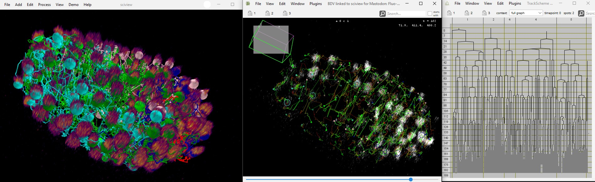
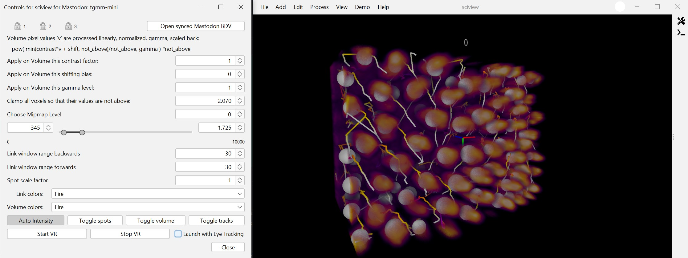
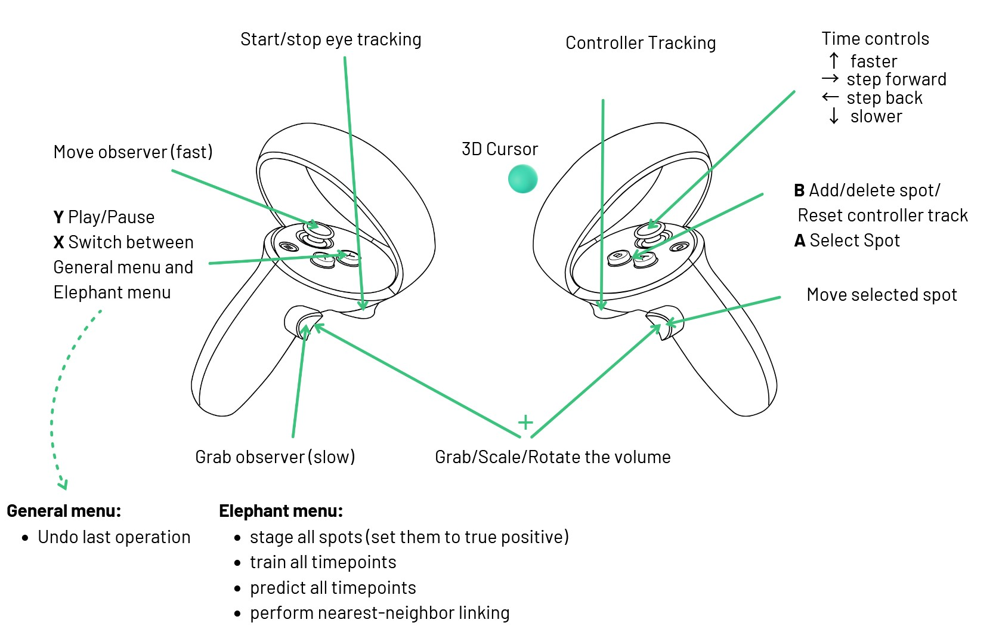

# manvr3d - Multimodal ANnotation in Virtual Reality/3D
This is a reincarnation of [an earlier project `mastodon-sciview`](https://github.com/mastodon-sc/mastodon-sciview/) by [`xulman`](https://github.com/xulman) and [`RuoshanLan`](https://github.com/ruoshanlan).
It aims to bridge [Mastodon](https://github.com/mastodon-sc) with interactive 3D visualization in [sciview (and scenery)](https://github.com/scenerygraphics/sciview)
and extends it with [eye tracking](https://link.springer.com/chapter/10.1007/978-3-030-66415-2_18)-based cell tracking and other VR tracking/editing/exploration modalities.

The repository was started during the [scenery and sciview hackathon](https://imagesc.zulipchat.com/#narrow/stream/391996-Zzz.3A-.5B2023-06.5D-scenery.2Bsciview-hackathon-dresden)
in Dresden (Germany) in June 2023, where most of the code was contributed by [`xulman`](https://github.com/xulman). Samuel Pantze ([`smlpt`](https://github.com/smlpt/)) is the current maintainer
and extends the bridge with eye tracking, real-time data synchronization, VR interaction functionality and connection to [ELEPHANT](https://elephant-track.github.io/#/)
to create an interactive human-in-the-loop .

> Keep in mind that this project is under heavy development. Things might not work as intended, they may break or crash.
> Feel free to reach out on [Zulip](https://imagesc.zulipchat.com/#narrow/channel/327470-Mastodon/topic/sciview.20bridge/with/507278423)
> or open an issue.

## The standard view
Here's an example of data inspection that can be made possible via this project. It features volumetric rendering overlaid with colored spheres.
The pixel data, spheres and their color come from the Mastodon, the latter in particular shows colors assigned to individual cell tracks:

The bridge also allows for rendering track data. Each track can either be colored according to a LUT,
where the timepoint defines the color of each link, or using the corresponding spot tag sets.

# How to use
Since this projects relies on Mastodon data, one should first open a project in Mastodon and then in Mastodon click `Window -> New sciview`.

## Opening
Two dialog windows shall pop up.

The left one opens the first and asks:
- Whether the content shall be displayed in an already opened sciview window (if there's one),
or whether it definitively should be displayed in a separate sciview window.
- Whether the controls panel should be opened right away (if not, one can always open it later, usually with Ctrl+I).
- Which pixel data channel should be used for the volumetric pixel display in sciview.

Afterward, the right-hand side dialog opens and asks:
- Which resolution level, from the chosen pixel data channel, should be used.

Since pixel data can be additionally, on-the-fly copied and modified,
it is advisable to start first with the lowest resolution available, and potentially reopen again with higher resolution
later if the data size and performance of your system are handling everything smoothly.

## Displayed content
When sciview is started, it displays the pixel data via volumetric rendering, the spheres (referred to as *spots*),
tracks  (consisting of cylinders, also called links) and orientation axes
(with the meaning that red, green, and blue point in the positive directions of the *Mastodon* x-, y-, and z-axis, respectively).

One can (temporarily) hide some of the displayed content or alter its appearance by using
the toggles in the bridge UI.

## Viewing options
However, controls relevant to the tracking context (plus convenience shortcut controls) are put together in the controls panel.
The panel, for example, summarizes [how (copies of the) pixel data are additionally processed in order to improve their appearance](doc/CONTROLS.md),
and allows to adjust parameters of it:

The control panel allows for setting different LUTs for both the volume and the tracks.
The visible range of track segments (aka links) can be configured both for a forward and a backward range.

Opening a new Mastodon's BDV (BigDataViewer) window via the panel's top-right button `Open synced Mastodon BDV` will make sciview's view follow
that BDV's view. That said, the change of *view angle* (but not panning nor zooming) in that BDV is immediately applied also to sciview, which makes
sciview look at the same piece of data. Enabled colors (tags) in that BDV are also immediately effective in sciview. Last but not least, selecting
a spot in Mastodon selects it also in the sciview and displays it's sphere in bright red.
This works also in the opposite direction: selecting a sphere in sciview forces Mastodon to focus on the counterpart spot.
Which time point is currently displayed  is also linked between the two.

Additionally, the controls panel contains the same three locks as it is in Mastodon, and it works as expected.

## Keyboard shortcuts
The summary of the currently available keyboard keys can be opened into a separate, non-model window by selecting the menu `Help -> Mastodon Bridge` in sciview.

Sometimes, it is necessary to (right) mouse click into the main viewing pane of the sciview to make it react to key presses
(technically, to assure it's focused and receives OS events). 

## VR interaction

> Use of eye trackers is currently only tested to work with a pair of Pupil eye trackers that require running Pupil Service alongside the bridge.

> Controller tracking should work with any modern headset, but the control scheme was only tested to work with a Meta Quest 2.

You can launch a VR session by clicking "Start VR" in the control panel. Deselect the "Launch with Eye Tracking" toggle
if you only want to use controller tracking and don't have compatible eye tracking hardware (recommended).

Currently, the controller scheme looks something like this:

# How to compile and deploy
[Please refer to `doc/COMPILE.md`](doc/COMPILE.md)
